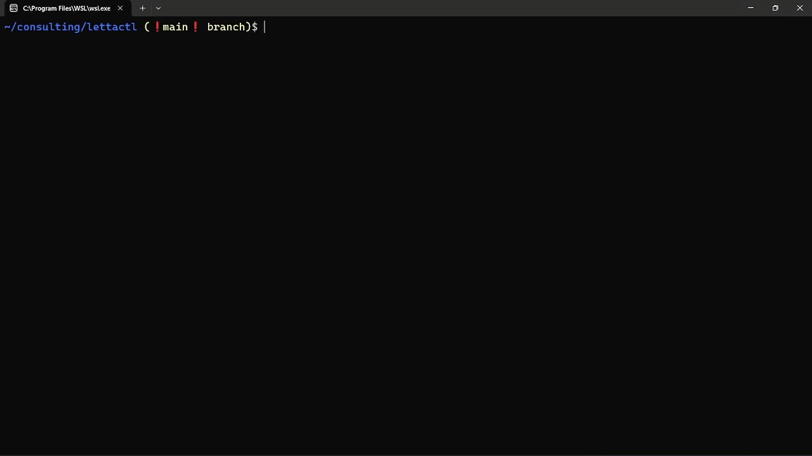
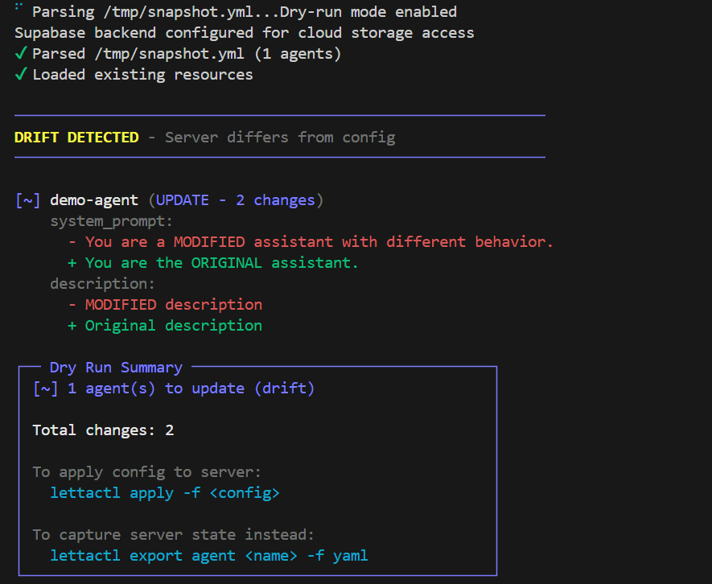

# LettaCTL

[](https://github.com/nouamanecodes/lettactl/actions)
[](https://opensource.org/licenses/MIT)
[](https://www.typescriptlang.org/)
[](https://socket.dev/npm/package/lettactl)


A kubectl-style CLI for managing stateful [Letta](https://github.com/letta-ai/letta) AI agent fleets with declarative configuration. Define your entire agent setup in YAML and deploy with one command.

- [Official Letta Docs](https://docs.letta.com/guides/community/lettactl/) - LettaCTL is an official Letta community tool
- [LettaCTL Docs](https://lettactl.dev) - Full documentation
- [Letta Discord](https://discord.com/invite/letta) - Support and discussions

## Get started

Install the LettaCTL CLI:

```bash
npm install -g lettactl
```

Point it at your Letta server:

```bash
# Named remotes (recommended)
lettactl remote add local http://localhost:8283
lettactl remote add cloud https://api.letta.com --api-key sk-xxx --project-id project-xxx
lettactl remote use local

# Or environment variables
export LETTA_BASE_URL=http://localhost:8283
```

For Letta Cloud projects, list available projects and scope commands with the
project id or slug:

```bash
lettactl get projects

export LETTA_PROJECT_ID=project-xxx   # sends X-Project-Id
# or
export LETTA_PROJECT=my-project-slug  # sends X-Project
```

Configure BYOK model providers declaratively, then use the synced model handle
on agents:

```yaml
providers:
  - name: my-bedrock
    provider_type: bedrock
    api_key:
      from_env: AWS_SECRET_ACCESS_KEY
    access_key:
      from_env: AWS_ACCESS_KEY_ID
    region: us-east-1
prune_missing_providers: true # Optional: delete project providers absent from this YAML

agents:
  - name: my-agent
    llm_config:
      model: "my-bedrock/<bedrock-model-id>"
      context_window: 64000
    system_prompt:
      value: "You are helpful."
```

For Bedrock, `api_key` is the AWS secret access key and `access_key` is the
AWS access key ID. Run `lettactl get models --query my-bedrock` after apply to
see the exact provider-prefixed handles Letta exposes.

## Quick example

Create `agents.yml`:

```yaml
agents:
  - name: my-agent
    description: "My AI assistant"
    llm_config:
      model: "openai/gpt-4.1"
      context_window: 128000
    system_prompt:
      value: "You are a helpful assistant."
    memory_blocks:
      - name: user_info
        description: "What you know about the user"
        limit: 2000
        agent_owned: true
        value: "No information yet."
```

Deploy:

```bash
lettactl apply -f agents.yml
```

That's it. See what changed with `--dry-run`, update the YAML and re-apply — only diffs are applied, conversation history is preserved.

## Key Features

### Declarative Fleet Management ([full guide](https://lettactl.dev/commands/deployment))

Deploy entire agent fleets from YAML with shared resources:

```yaml
shared_blocks:
  - name: company_guidelines
    description: "Shared across all agents"
    limit: 5000
    agent_owned: true
    from_file: "memory-blocks/guidelines.md"

agents:
  - name: support-agent
    # ...
    shared_blocks: [company_guidelines]
    memory_blocks:
      - name: ticket_context
        description: "Current ticket info"
        limit: 2000
        agent_owned: false    # YAML syncs on every apply
        value: "No active ticket."
    folders:
      - name: docs
        files: ["files/*"]    # Auto-discover files
    tools:
      - archival_memory_insert
      - archival_memory_search
      - tools/*               # Auto-discover Python tools
```

```bash
lettactl apply -f fleet.yml              # Deploy all agents
lettactl apply -f fleet.yml --dry-run    # Preview changes (drift detection)
lettactl apply -f fleet.yml --agent one  # Deploy specific agent
```

### Letta Code Agents

Deploy Cloud agents that use git-backed MemFS, agent-owned skills, and Letta Code secrets:

```yaml
agents:
  - name: code-agent
    llm_config:
      model: "letta/glm"
      context_window: 32000
    system_prompt:
      value: "You are helpful."
    include_base_tools: false
    include_base_tool_rules: false
    memory:
      mode: memfs
      bare_repo: auto
      template_dir: agents/code-agent/memfs
      preserve_existing_paths:
        - system/persona.md
        - system/state.md
      prune_missing_skills: true
      files:
        - to: system/important_variables.md
          value: |
            # Important Variables
            - COMPANY_ID: company-123
      skills:
        - name: app-api
          from_dir: agents/skills/app-api
    secrets:
      APP_AGENT_TOKEN:
        from_env: APP_AGENT_TOKEN
        preserve_existing: true
```

```bash
lettactl apply -f fleet.yml --dry-run          # Shows MemFS and secret drift
lettactl apply -f fleet.yml --root .           # Resolves template_dir/from_dir paths from repo root
lettactl apply -f fleet.yml --reproject-skills # Force skills/*/SKILL.md to re-render on running agents
```

> **`--reproject-skills`** — Letta Cloud re-renders `system/*` MemFS files on a normal apply, but a `skills/*/SKILL.md` **content change does not render on a running agent** — only agent recreation or a detach + re-attach does. This flag detaches + re-adds each skill's current content (two pushes) then agent-recompiles, so skill edits take effect without recreation. Content- and conversation-preserving; runs even when the memfs diff is a no-op (fixes already-stale agents).

Use `memory.template_dir` for system MemFS files, `memory.skills[].from_dir` for
directories containing `SKILL.md`, and `agents[].secrets` or `global-secrets` for
Letta Code secret sync. Add `memory.preserve_existing_paths` for mutable files
that should be seeded on first deploy but preserved after the agent edits them.
Set `memory.prune_missing_skills: true` when `memory.skills` is the managed skill
catalog and deploys should delete stale `skills/<name>` files missing from the
template.
Use `memory.files[]` for explicit inline or `from_file` content, especially
per-agent dynamic system files. See the full docs for schema details.

MemFS agents default to `include_base_tools: false` and
`include_base_tool_rules: false` so Letta Code skills start from a clean server
tool allowlist. Classic block agents keep base tools enabled by default. Set
`include_base_tools: true` and list tools explicitly when a MemFS agent should
use server tools such as `conversation_search`.

### Inspection & Debugging ([full guide](https://lettactl.dev/commands/inspection))

```bash
lettactl get agents                      # List agents
lettactl get projects                    # List Letta Cloud projects
lettactl get providers                   # List configured BYOK providers
lettactl get models --query bedrock      # Find model handles
lettactl get all                         # Server overview
lettactl describe agent my-agent         # Full details + blocks/tools/messages
lettactl get blocks --orphaned           # Find orphaned resources
lettactl get tools --shared              # Tools used by 2+ agents
```

### Messaging ([full guide](https://lettactl.dev/commands/messaging))

```bash
lettactl send my-agent "Hello"           # Async send (polls until complete)
lettactl send my-agent "Hello" --stream  # Streaming response
lettactl get messages my-agent           # Conversation history
```

### Resource Duplication ([full guide](https://lettactl.dev/commands/lifecycle))

```bash
lettactl duplicate agent my-agent copy   # Full agent clone
lettactl duplicate block my-block copy   # Block clone
lettactl duplicate archive my-kb copy    # Archive + passages clone
```

### Canary Deployments ([full guide](https://lettactl.dev/commands/canary))

```bash
lettactl apply -f fleet.yml --canary                    # Deploy canary copies
lettactl apply -f fleet.yml --canary --promote --cleanup # Promote + teardown
```

### Export & Import ([full guide](https://lettactl.dev/commands/import-export))

```bash
lettactl export agent my-agent -f yaml -o agents.yml    # Git-trackable YAML
lettactl export agents --all -f yaml -o fleet.yml       # Bulk export
lettactl import backup.json                              # Restore from backup
```

### Multi-Tenancy with Tags ([full guide](https://lettactl.dev/commands/fleet))

```bash
lettactl get agents --tags "tenant:acme"                # Filter by tenant
lettactl get agents --tags "tenant:acme,role:support"   # AND logic
```





## SDK Usage

LettaCTL also works as a programmatic SDK for building applications:

```bash
pnpm add lettactl
```

```typescript
import { LettaCtl } from 'lettactl';

const ctl = new LettaCtl({
  lettaBaseUrl: 'https://api.letta.com',
  lettaApiKey: process.env.LETTA_API_KEY,
  lettaProjectId: 'project-xxx',
});

// Deploy from YAML string
await ctl.deployFromYamlString(`
agents:
  - name: user-${userId}-assistant
    description: "Assistant for ${userId}"
    llm_config:
      model: "openai/gpt-4.1"
      context_window: 128000
    system_prompt:
      value: "You help user ${userId}."
`);

// Or build programmatically
const fleet = ctl.createFleetConfig()
  .addAgent({
    name: 'my-agent',
    description: 'My assistant',
    llm_config: { model: 'openai/gpt-4.1', context_window: 128000 },
    system_prompt: { value: 'You are helpful.' }
  })
  .build();

await ctl.deployFleet(fleet);

// Send messages
const run = await ctl.sendMessage(agentId, 'Hello!');
const completed = await ctl.waitForRun(run.id);

// Delete with full cleanup
await ctl.deleteAgent('my-agent');
```

## All Commands

| Category | Commands |
|----------|----------|
| **Deploy** | `apply`, `validate`, `create agent`, `update agent` |
| **Inspect** | `get <resource>`, `describe <resource>`, `health`, `context`, `files` |
| **Message** | `send`, `get messages`, `reset-messages`, `compact-messages`, `recompile`, `--conversation-id` |
| **Lifecycle** | `duplicate`, `delete`, `delete-all`, `cleanup` |
| **Export** | `export agent`, `export agents`, `export lettabot`, `import` |
| **Runs** | `get runs`, `get run`, `track`, `run-delete` |
| **Fleet** | `report memory`, `memory.mode=memfs`, `memory.skills`, `memory.prune_missing_skills`, `global-secrets`, `agents[].secrets`, `--canary`, `--fresh-context`, `--compact`, `--recalibrate`, `--skip-recompile`, `--match`, `--no-wait-for-idle` |
| **Config** | `remote add/use/list/remove`, `completion` |

Run `lettactl --help` or visit [lettactl.dev](https://lettactl.dev) for full documentation.

## Contributing

- [Open an issue](https://github.com/nouamanecodes/lettactl/issues) for bugs or feature requests
- Join the [Letta Discord](https://discord.com/invite/letta) for discussions

## License

MIT
